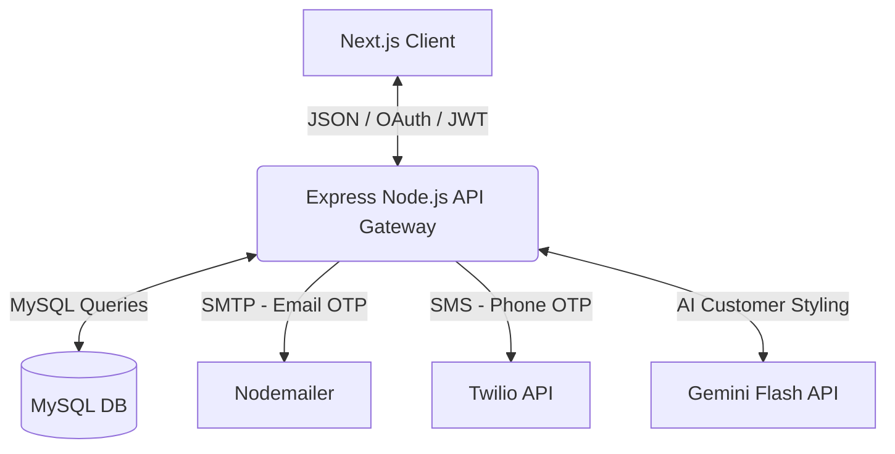
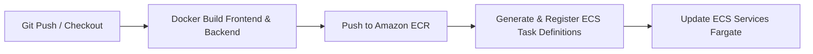

# 🛍️ ShopEase — Enterprise Full-Stack E-Commerce Store

[](https://opensource.org/licenses/MIT)
[](https://nextjs.org)
[](https://nodejs.org)
[](https://www.mysql.com/)
[](https://www.docker.com/)
[](https://aws.amazon.com/ecs/)
[](https://www.jenkins.io/)

ShopEase is an enterprise-grade, full-stack e-commerce marketplace featuring user identity management, multi-channel OTP verification (Email + SMS), shopping cart/order flows, a real-time customer stylist chat assistant powered by Gemini AI, and a production CI/CD deployment pipeline on AWS ECS Fargate via Jenkins.

---

## 🌟 Key Features

*   **🛒 Seamless Shopping Flow:** Dynamic product catalog with keyword filtering, categories, item-quantity cart management, and order placement history.
*   **🛡️ Multi-Channel OTP Authentication:** Enhanced security using Nodemailer (Email) and Twilio (SMS/Phone) verification challenges.
*   **🔑 Federated Identity:** Single-click sign-in option powered by Google OAuth Integration.
*   **🤖 Gemini AI Luxury Concierge:** Personal stylist assistant powered by Gemini 3.5 Flash, feeding catalog database context directly into system prompts. Includes intelligent simulation fallbacks.
*   **🌀 Modern UX Interactions:** Stunning interface leveraging Next.js 14, Framer Motion animations, Lenis smooth scrolling, and Tailwind CSS.
*   **🚀 Production CI/CD Pipeline:** Complete [Jenkinsfile](file:///E:/claude1/Jenkinsfile) automating ECR authentication, Docker image compilation, ECS Task Definition generation, and blue-green Fargate deployment updates.

---

## 🏗️ System & Pipeline Architecture

### Application Data Flow


### Jenkins CI/CD Deployment Flow


---

## 📂 Repository Structure

The project uses a structured microservices monorepo:

*   **[docker-compose.yml](file:///E:/claude1/docker-compose.yml):** Bootstraps local orchestrations of MySQL, Backend, and Next.js services.
*   **[Jenkinsfile](file:///E:/claude1/Jenkinsfile):** Automated pipeline configurations mapping building stages and ECS Fargate deployments.
*   **[database/](file:///E:/claude1/database):** Relational schema configurations.
    *   [init.sql](file:///E:/claude1/database/init.sql): Schema DDL, constraints mapping, categories, products, and admin seeds.
*   **[backend/](file:///E:/claude1/backend):** REST API Gateway.
    *   [src/server.js](file:///E:/claude1/backend/src/server.js): Express server setup and routing paths.
    *   [src/controllers/](file:///E:/claude1/backend/src/controllers): Route business logic controllers (auth, cart, orders, products, chat).
    *   [src/routes/](file:///E:/claude1/backend/src/routes): Endpoint routers mapping.
    *   [src/middleware/](file:///E:/claude1/backend/src/middleware): Token validation and request verification middleware.
*   **[frontend/](file:///E:/claude1/frontend):** React & Next.js 14 web app.
    *   [app/](file:///E:/claude1/frontend/app): Pages, checkout views, dashboard routing, context providers, and static styles.
    *   [nginx.conf](file:///E:/claude1/frontend/nginx.conf): Nginx configuration serving the compiled production bundle.
*   **[ecs/](file:///E:/claude1/ecs):** Infrastructure templates.
    *   [task-def-backend.json](file:///E:/claude1/ecs/task-def-backend.json): Task definitions schema for Node container running on AWS ECS.
    *   [task-def-frontend.json](file:///E:/claude1/ecs/task-def-frontend.json): Task definitions schema for Nginx container running on AWS ECS.

---

## 🔐 Database Schema

The backend uses a MySQL instance. The relational schema is structured as follows:

```
                  ┌──────────────────┐
                  │      users       │
                  └────────┬─────────┘
                           │ 1
                           │
                           │ 1..*
                  ┌────────┴─────────┐
                  │      orders      │
                  └────────┬─────────┘
                           │ 1
                           │
                           │ 1..*
 ┌──────────────┐ 1..* ┌───┴─────────┐ 1..* ┌──────────────┐
 │  categories  ├──────┤  products   ├──────┤  cart_items  │
 └──────────────┘      └─────────────┘      └──────────────┘
```

### Core Tables

1.  **`users`:** Stores accounts, roles (`customer`, `admin`), email/phone verification status flags, and OAuth identities.
2.  **`otps`:** Tracks temporary 6-digit numeric codes generated for phone or email MFA.
3.  **`categories`:** Organizes product items (e.g. Electronics, Fashion, Home & Kitchen, Books).
4.  **`products`:** Catalog listings mapping details, stock quantities, image references, and prices.
5.  **`cart_items`:** Junction table recording active customer shopping sessions mapping user items and quantities.
6.  **`orders`:** Order states (`pending`, `paid`, `shipped`, `delivered`, `cancelled`) and total pricing.
7.  **`order_items`:** Line-item archive documenting exact price snapshots at order checkout time.

---

## 🛠️ Configuration & Environment Variables

Create a `.env` file in the root directory. Configure the variables listed below:

| Environment Variable | Description | Example / Recommended Value |
| :--- | :--- | :--- |
| `DB_NAME` | MySQL database name to initialize. | `ecommerce_db` |
| `DB_PASSWORD` | Access password for root database user. | `rootpassword` |
| `JWT_SECRET` | Secret token string for signing login tokens. | *generate_long_random_hash* |
| `SMTP_HOST` | Host URL for outbound emails. | `smtp.gmail.com` |
| `SMTP_PORT` | Port configuration for outbound emails. | `587` |
| `SMTP_USER` | Authenticated email sender account. | `your-email@example.com` |
| `SMTP_PASS` | Password token corresponding to email user. | *gmail_app_password* |
| `SMTP_FROM` | Sender representation format. | `"ShopEase <your-email@example.com>"` |
| `TWILIO_ACCOUNT_SID` | Twilio developer account identifier. | *ACxxxxxxxxxxxxxx* |
| `TWILIO_AUTH_TOKEN` | Twilio client secret authentication token. | *token_secret* |
| `TWILIO_PHONE_NUMBER` | Outbound SMS number issued by Twilio. | `+1234567890` |
| `GOOGLE_CLIENT_ID` | OAuth Client ID from Google Cloud Console. | *google_oauth_id* |
| `GEMINI_API_KEY` | Google Generative Language key for chatbot. | *gemini_flash_key* |
| `FRONTEND_URL` | Domain URL for client callback routing. | `http://localhost` |

---

## 🚀 Getting Started

### Option 1: Docker Compose (Recommended)

Build and run the entire ecosystem locally inside containerized environments:

1.  **Configure environment variables:**
    Ensure you created the `.env` file in the root of the project.
2.  **Spin up containers:**
    ```bash
    docker compose up --build
    ```
    This spins up:
    *   **MySQL Database** mapping default schema seeds on port `3306`.
    *   **Express Server API Gateway** running on port `5000`.
    *   **Next.js Production Nginx Web Server** running on port `80`.
3.  **Open portals:**
    *   **Storefront Client:** http://localhost
    *   **API Gateway Direct:** http://localhost:5000/api/health
4.  **Tear down services:**
    ```bash
    docker compose down -v # -v removes persistent DB volumes for a clean reset
    ```

---

### Option 2: Local Development

Run frontend and backend services directly in your host environment:

#### 1. Database Setup
*   Install MySQL Server locally.
*   Import the seed file [init.sql](file:///E:/claude1/database/init.sql):
    ```bash
    mysql -u root -p < database/init.sql
    ```

#### 2. Start Backend REST API
```bash
cd backend
npm install
# Ensure you copy environment variables to a local .env file in backend/
npm run dev
```
Runs the Express development server on http://localhost:5000.

#### 3. Start Next.js App
```bash
cd frontend
npm install
npm run dev
```
Runs the Next.js development server on http://localhost:3000 (or port `3000` mapping config).

---

## 🔌 API Reference Table

| Scope | Method | Endpoint | Auth | Description |
| :--- | :--- | :--- | :--- | :--- |
| **System** | `GET` | `/api/health` | No | Basic server health test. |
| **Auth** | `POST` | `/api/auth/register` | No | Registers new accounts. |
| **Auth** | `POST` | `/api/auth/login` | No | Validates credentials, returns JWT. |
| **Products** | `GET` | `/api/products` | No | Lists catalog products (supports query parameters). |
| **Products** | `GET` | `/api/products/:id` | No | Fetches a single product's details. |
| **Products** | `GET` | `/api/products/categories` | No | Lists all database product categories. |
| **Products** | `POST` | `/api/products` | **Admin** | Inserts a new product into the catalog. |
| **Cart** | `GET` | `/api/cart` | **Yes** | Retrieves items in user's shopping cart. |
| **Cart** | `POST` | `/api/cart` | **Yes** | Appends or updates an item in the cart. |
| **Cart** | `PUT` | `/api/cart/:id` | **Yes** | Updates quantity of a cart item. |
| **Cart** | `DELETE` | `/api/cart/:id` | **Yes** | Removes an item from the cart. |
| **Orders** | `POST` | `/api/orders` | **Yes** | Checks out cart and creates a new order. |
| **Orders** | `GET` | `/api/orders` | **Yes** | Retrieves customer's order history. |
| **Chat** | `POST` | `/api/chat` | No | Submits message prompt to AI stylist concierge. |

---

## 🛡️ DevOps CI/CD Integration (Jenkins)

The [Jenkinsfile](file:///E:/claude1/Jenkinsfile) included in this repository automates deployments using AWS ECS Fargate:

1.  **Checkout Source:** Syncs with GitHub main branch.
2.  **ECR Login:** Authenticates local docker engine with AWS ECR Registry.
3.  **Task Definitions:** Templatizes `ecs/task-def-backend.json` and `ecs/task-def-frontend.json` with environment mappings.
4.  **Secure Environment:** Hydrates Jenkins Vault secrets (passwords, SID tokens, API keys) into env files.
5.  **Build & Push:** Compiles Docker builds for both Frontend and Backend, pushes tags to AWS Elastic Container Registry.
6.  **Fargate Deploy:** Registers generated task definitions and updates Fargate cluster tasks.

---

## 📝 License

Distributed under the MIT License. See `LICENSE` for more details.
